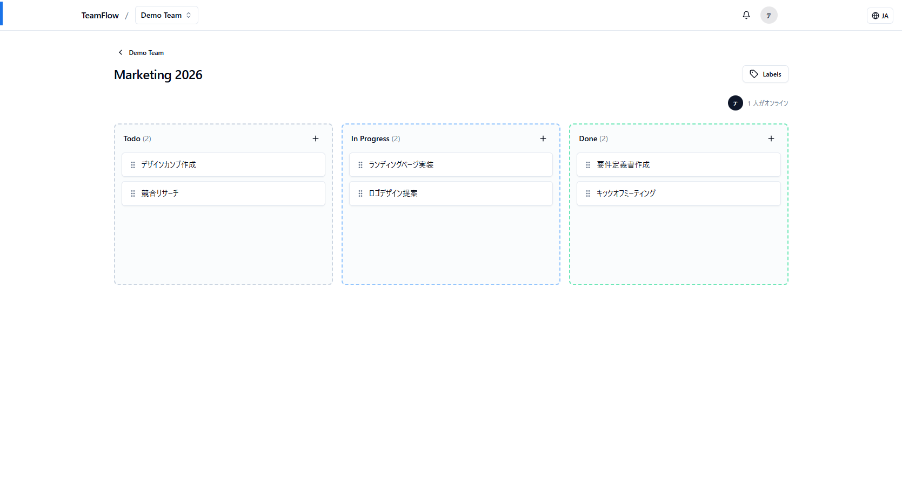
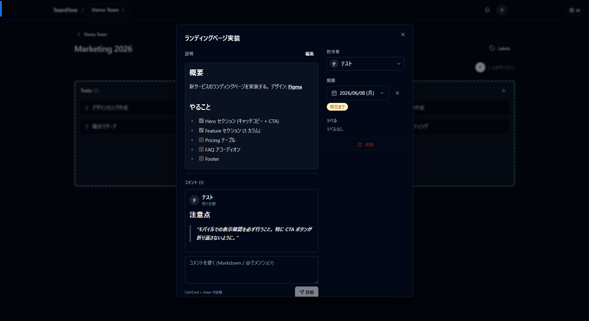
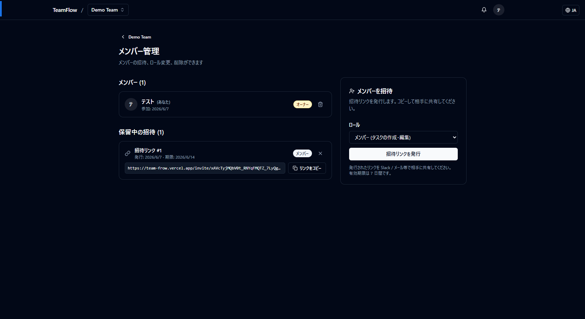
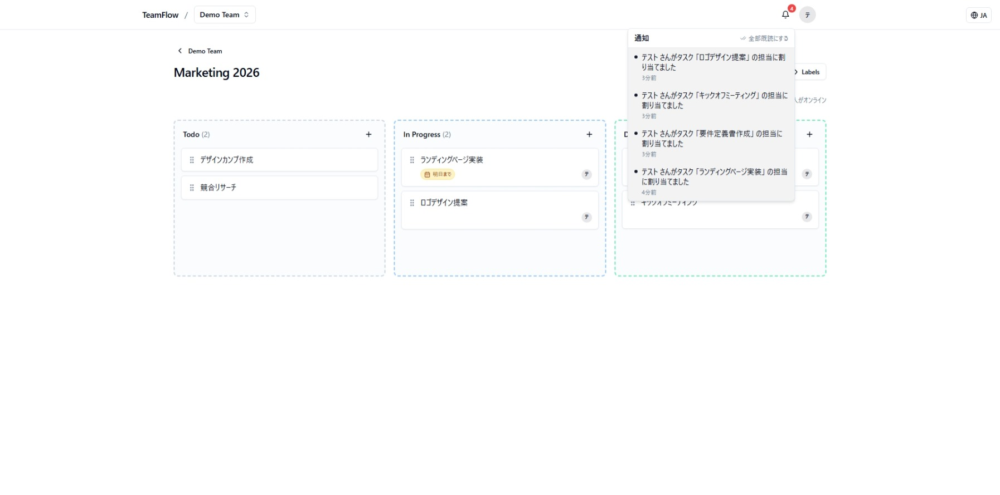

# TeamFlow

> チーム向けのリアルタイム協調型タスク管理 SaaS。Linear / Notion / Asana の機能を **Next.js + Supabase + TypeScript** で実装したミニ版です。

🔗 **デモ**: <!-- Vercel URL を貼る --> `https://teamflow-xxx.vercel.app`

---

## ✨ 特徴

- 🏢 **マルチワークスペース** — 複数チームに所属、招待リンクでメンバー追加
- 🔐 **3 段階ロール** — Owner / Admin / Member の権限制御
- 📋 **カンバンボード** — ドラッグ&ドロップで進捗管理
- ⚡ **リアルタイム同期** — 他のメンバーの編集が即座に画面に反映
- 👥 **プレゼンス表示** — 「今ボードを見ているメンバー」をアバターで可視化
- 💬 **コメント + @メンション** — Markdown 対応、メンション通知付き
- 🔔 **通知センター** — 未読バッジ、ベルアイコンから一覧
- 🌐 **多言語対応** — 日本語 / 英語 切替
- 🛡️ **Row Level Security** — DB レベルで多テナント分離

---

## 🚀 デモアカウント

デモ URL から以下のテストアカウントでログインできます (実装後に追加):

| ロール | メール | パスワード |
|---|---|---|
| Owner | `demo-owner@teamflow.app` | `demo123456` |
| Member | `demo-member@teamflow.app` | `demo123456` |

または新規登録 → 自動でワークスペースが作成されてすぐ使えます。

---

## 🛠️ 技術スタック

| カテゴリ | 採用技術 |
|---|---|
| フレームワーク | Next.js 15 (App Router, Server Actions, Server Components) |
| 言語 | TypeScript |
| DB / 認証 / Realtime | Supabase (Postgres + Auth + Realtime) |
| スタイリング | Tailwind CSS + shadcn/ui (Radix Primitives) |
| ドラッグ&ドロップ | dnd-kit |
| Markdown | react-markdown + remark-gfm |
| 日付 | date-fns + react-day-picker |
| 国際化 | next-intl (Cookie ベース) |

---

## 📸 スクリーンショット

<!-- 実装後にスクショ追加 -->

| カンバンボード | タスク詳細 (Markdown + 担当者 + ラベル) |
|---|---|
|  |  |

| メンバー管理 + 招待リンク | 通知センター |
|---|---|
|  |  |

---

## 🏃 ローカル開発

### 1. 依存インストール

```bash
npm install
```

### 2. Supabase プロジェクト準備

1. [supabase.com](https://supabase.com/) で新規プロジェクトを作成
2. **SQL Editor** で [supabase/schema.sql](supabase/schema.sql) を Run
3. **Authentication** → **Sign In / Up** → **Email** → `Confirm email` を **OFF** (開発用)
4. **Authentication** → **URL Configuration**:
   - Site URL: `http://localhost:3000`
   - Redirect URLs: `http://localhost:3000/**`
5. **Settings** → **API** から **Project URL** と **anon key** を取得

### 3. 環境変数

```bash
cp .env.local.example .env.local
```

`.env.local` を編集:

```env
NEXT_PUBLIC_SUPABASE_URL=https://xxx.supabase.co
NEXT_PUBLIC_SUPABASE_ANON_KEY=eyJhbGciOi...
```

### 4. 起動

```bash
npm run dev
```

`http://localhost:3000` を開いて新規登録から開始。

---

## 📁 主要ディレクトリ

```
src/
├── app/
│   ├── (auth)         ランディング / login / signup / メール確認
│   ├── auth/callback  メール認証コールバック
│   ├── invite/[token] 招待リンク受諾ページ
│   └── workspaces/
│       ├── page.tsx                     ワークスペース一覧
│       └── [slug]/
│           ├── page.tsx                 ダッシュボード (プロジェクト一覧)
│           ├── members/                 メンバー管理・招待
│           ├── labels/                  ラベル管理
│           └── projects/[id]/
│               ├── page.tsx             カンバンページ
│               ├── board.tsx            カンバン + Realtime + Presence
│               ├── task-detail.tsx      タスク詳細モーダル
│               └── comments.tsx         コメント + @メンション
├── components/
│   ├── ui/                              shadcn/ui プリミティブ
│   ├── app-header.tsx                   ヘッダー (workspace switcher + notifications + language)
│   ├── notification-bell.tsx            通知ベル
│   └── workspace-switcher.tsx           ワークスペース切替
├── lib/
│   ├── supabase/                        ブラウザ/サーバー/ミドルウェア用クライアント + Database 型
│   ├── workspace.ts                     requireWorkspace ヘルパー (RLS + アクセス制御)
│   ├── labels.ts / due-date.ts          ドメインロジック
│   └── translate-error.ts               エラーメッセージの多言語化
├── i18n/                                next-intl 設定
└── middleware.ts                        Supabase セッション + 認証ガード

supabase/
└── schema.sql                           DB スキーマ + RLS + RPC + Realtime publication

messages/
├── ja.json                              日本語翻訳
└── en.json                              英語翻訳
```

---

## 🏗️ アーキテクチャの要点

### Row Level Security でデータ漏洩を多重防御

すべてのテーブルに RLS を設定し、「自分が所属するワークスペースのデータしか触れない」を **DB レベルで強制**。アプリのバグや SQL インジェクションがあってもデータが漏れない設計。

### SECURITY DEFINER で RLS の再帰回避

`workspace_members` を参照する RLS で再帰しないよう、`is_workspace_member()` を SECURITY DEFINER 関数で抽象化。

### 招待リンク = ランダムトークン + RPC

未認証ユーザーでも招待画面を表示できるよう、招待情報の閲覧は SECURITY DEFINER の RPC `invitation_info(token)` 経由。トークンは 192bit のランダム値。

### Realtime + Presence で多人数同時編集

Supabase Realtime (Postgres 論理レプリケーション) でタスク・コメント・通知の変更を全クライアントに配信。Presence でボードを見ているユーザーをアバター表示。

### i18n は UI のみ翻訳、ユーザー入力は原文保持

Linear / Notion 等の業界標準に倣い、UI label のみ翻訳。ユーザーが書いたタスク名やコメントは原文のまま (意図を改変しない)。

---

## 🗺️ 開発フェーズ

このプロジェクトは段階的に構築されました:

| Phase | 内容 |
|---|---|
| Phase 1 | ワークスペース / メンバー / 招待 / ロール権限 |
| Phase 2 | タスク詳細モーダル (Markdown / 担当者 / 期限 / ラベル) |
| Phase 3 | Realtime 同期 + Presence + i18n |
| Phase 4 | コメント + @メンション + 通知センター |

---

## 🔮 今後の改善案

- タスクコメント機能の拡張 (絵文字リアクション、編集)
- アクティビティフィード (誰がいつ何をしたか)
- ファイル添付 (Supabase Storage)
- ダークモード
- E2E テスト (Playwright)
- OAuth (Google / GitHub)
- メール通知 (Resend 等)

---

## 📜 ライセンス

ポートフォリオ目的。商用利用想定なし。
